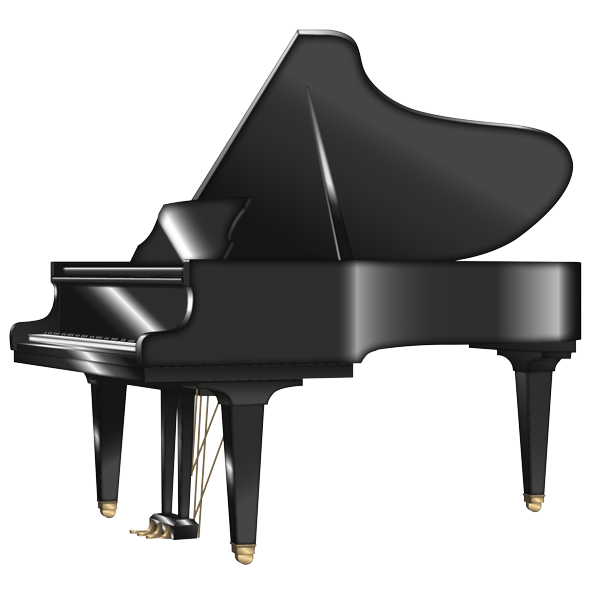

### Hello! I'm Meaghan Estrada 👋🏽

 
---------------------------------------------------------------------------------------------------------------------------------------------------------------------------------
**Pronouns: she/her/hers**
### 👩🏽‍💻 About Me

-  **🎓 Education:** B.S., Computer Science and Mathematics at the University of Florida	
-  **⚙️ Languages:** Python, C++, Java, HTML, CSS, JavaScript
-  **👯 Communities:** Girls Who Code, Women in Computer Science and Engineering, Association of Women in Mathematics
-  **✨ Hobbies:** Mathematics & Classical Pianist 🎼 

